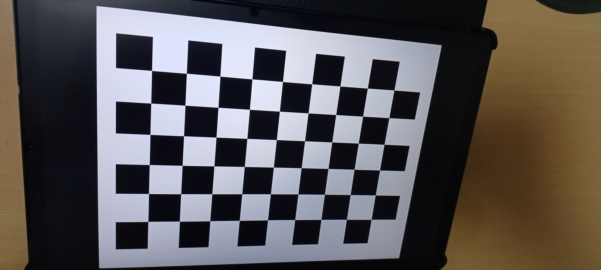
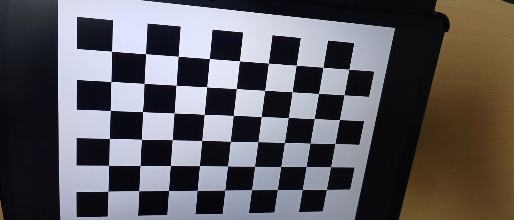

# Camera_Calibration
카메라의 내부 매개변수를 추정하고 그 결과를 사용하여 렌즈 왜곡을 수정합니다.

## Camera Calibration Results
* The number of applied images = 17
* RMS error = 0.06235064739353678
* Camera matrix K =
[[1.06171471e+03 0.00000000e+00 9.23375575e+02]
 [0.00000000e+00 1.06138084e+03 5.79315261e+02]
 [0.00000000e+00 0.00000000e+00 1.00000000e+00]]
* Distortion Coefficient (k1, k2, p1, p2, k3, ...) =
[[-0.00490145 -0.04941914 -0.00028208 -0.00054025  0.0159563 ]]

## Lens Distortion Correction
* 아래 이미지는 왜곡 보정 전/후 비교입니다:

| Original | Undistorted |
|----------|-------------|
|  |  |

## Questions and Resolution(from ChatGPT)

### 📌 왜 보정된 이미지가 더 작아지고, 외곽이 왜곡되는가?

#### 📷 1. 렌즈 왜곡이란?

카메라는 현실을 완벽하게 평면에 맵핑하지 못합니다. 대표적으로 두 가지 왜곡이 있습니다:

- **Radial distortion (방사 왜곡)**: 중심에서 멀어질수록 곡선으로 휘는 현상 (배럴 또는 핀쿠션 형태)
- **Tangential distortion (접선 왜곡)**: 렌즈가 센서에 완벽히 수직이 아닐 때 발생

이런 왜곡을 **보정**한다는 건, 이미지의 픽셀을 **다시 재배치해서 '직선처럼' 보이도록** 만드는 것입니다.

---

#### 🎯 2. 보정 후 이미지가 작아지는 이유

```python
newcameramtx, roi = cv2.getOptimalNewCameraMatrix(...)
```

이 함수는 **왜곡을 보정하면서 유효한 부분만 잘라서** 보여줄 수 있도록 새로운 카메라 행렬과 ROI(Region of Interest)를 제공합니다.

- 보정 과정에서 이미지 외곽의 픽셀은 정보가 손실되거나 뒤틀릴 수 있음  
- `getOptimalNewCameraMatrix(..., alpha=1)`일 때도 왜곡 없는 안정적인 영역만 남기기 위해 크기를 줄임  
- `alpha=0`이면 더 많이 잘라서 더 왜곡 없는 정사각형 결과를 얻을 수 있음  

✅ 그래서 `dst = dst[y:y+h, x:x+w]`처럼 **ROI로 자르면 이미지가 더 작아지는 것처럼 보이는 것**입니다.

---

#### 🌀 3. 외부 물체가 더 이상하게 보이는 이유

왜곡 보정은 **카메라 렌즈에 맞춰** 보정하는 것이기 때문에 중심부 기준으로는 정확해지지만…

- 외곽의 직선들은 오히려 더 뒤틀려 보이거나 "밀린 듯한" 왜곡이 생길 수 있음  
- 특히 원래 왜곡이 심했던 경우, 그걸 반대로 '펴다 보니' 시각적으로 더 부자연스러워 보일 수도 있음  

또한, 카메라의 **Field of View (시야각)** 자체도 살짝 바뀌기 때문에, 우리가 원래 보던 화면과 다르게 느껴질 수 있습니다.

---

#### 💡 체크보드 변화가 안 느껴지는 이유?

- 체크보드는 중앙에 있고, 직선으로 구성되어 있어서 왜곡 보정 전후 차이를 맨눈으로 보기 힘듭니다  
- 하지만 실제로는 코너 위치가 미세하게 바뀌어 있고, 그게 calibration에 쓰입니다  

직접 코너를 그려서 비교해보면 더 잘 느껴집니다:

```python
cv2.drawChessboardCorners(img, pattern_size, corners, ret)
```

---

#### ✨ 요약

| 현상 | 원인 |
|------|------|
| 보정된 이미지 크기 작아짐 | `getOptimalNewCameraMatrix`에서 왜곡된 외곽을 잘라냄 |
| 외곽 물체가 왜곡됨 | 렌즈 왜곡 보정을 반대로 휘어서 보정하다 보니 외곽이 시각적으로 달라짐 |
| 체크보드 변화 없음처럼 보임 | 중심부에 있어서 왜곡 영향이 적고, 육안으로는 차이가 작음 |
